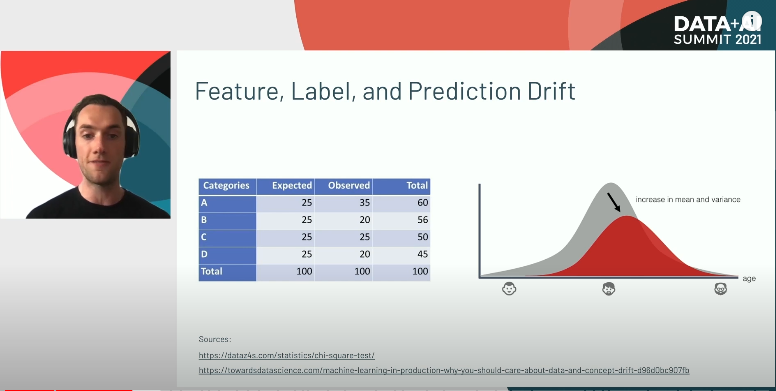
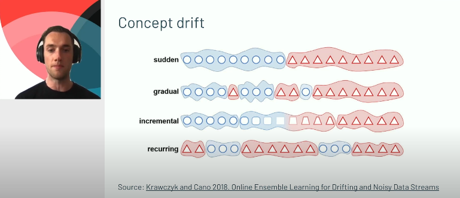
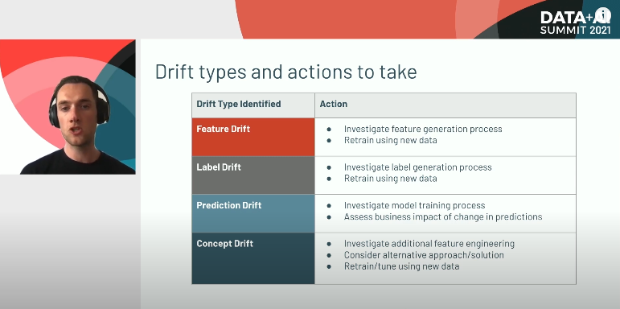
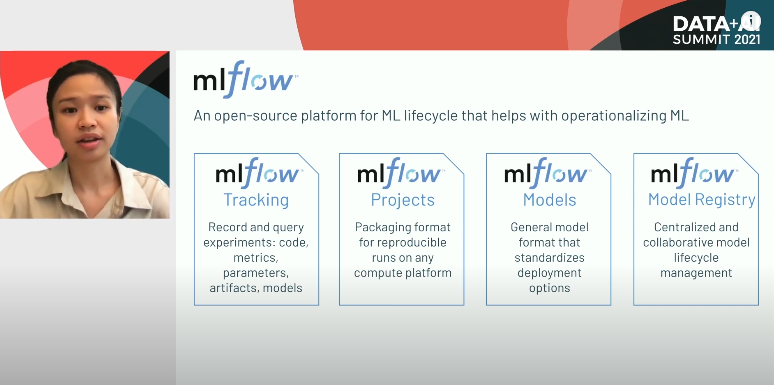

# Drifting Away: Testing ML Models in Production

# Intro

What this talk focuses on:
1. What are the statistical tests to use when monitoring models in production?
2. What tools can I use to coordinate the monitoring of data and models?

What this talk is not:
- A tutorial on model deployment strategies
- An exhaustive walk through on how to robustly test your production ML code
    - Unit tests/integration tests
- A prescriptive list of when to update a model in production
    - Testing/monitoring is unique to each use-case

# Machine Learning System Life Cycle

When does monitoring come into play in the overall ML lifecycle?

1. Business Problem
- Stakeholder comes with problem that we think can be solved with ML
2. Define Success Criteria
- Establish a business metric(s) to validate success for the model
- "What does success look like?"
3. Data collection
4. Data Preprocessing/Feature Engineering
- Do we have predictive features to predict the target?
5. Model Training/Model Evaluation
- This is the "fun", iterative step
- Update #3 and #4, and #5 model hyperparameters until we are happy with performance on test data set

MLOps: How do you actually operationalize an ML model?

6. Model Deployment
- This is the "real beginning" of the model lifecycle
7. Model Monitoring
- Deciding when/how to deploy the model depends on:
    - How quickly does new data arrive?
    - How long does our model take to train?
        - There is no silver bullet for ML deployments, it is very problem/domain specific

Often drastically overlooked: How a model will be maintained when in production
- Word of advice (1 thing to take away from this talk): When developing an ML solution, take considerable time to think about how the productionalized solution will be measured/monitored

# Why Monitor?

Model Deployment is not the end, but the beginning of model measurement/monitoring

Think about it this way: Power of a predictive model is a result of a model's ability to find patterns between some set of input features and a prediction target
- Model will perform well on new data, given that the new data is similar enough to the training data
- Even if we train on a suitable dataset, MORE OFTEN THAN NOT, the incoming data will change over time, in ways such as:
    - Upstream errors: A lot of changes in data will come from a data generation process
        - These are inevitable
    - External factors:
        - Market change: 
        - Human behavior change: 
    - And more! (there really are infinite choices)

So, models WILL degrade over time (not an "if", but a "when")

Challenge: Catching this when it happens!

# Model Drift

1 of the core reasons behind model degradation: Model Drift

Before understanding tests for drift, let's look at the different types of drift:

## Types of drift

1. Feature drift: Distributions of features we trained our model on has significantly changed
- Also known as data drift/covariance shift

2. Label drift: Distribution of our label has changed significantly
- Related to some outside influence ie. a shift in the underlying features itself

3. Prediction drift: Model prediction distribution deviates
- Related to label drift
    - Instead of being related to an outside influence, it is directly related to a feature that is part of the model (it affects the predictions)

4. Concept drift: Affects that happens due to outside influence
- Changes the underlying pattern that our model has learned
    - Underlying nature between features/label is not longer valid (it has "evolved" over time)

Examples (from ChatGPT): 

Illustrations:
1. Feature Drift (Data Drift/Covariance Shift)
- Example: A model was trained to predict customer churn based on features like age, income, and monthly usage of services.
    - Drift: Over time, the distribution of the feature "monthly usage of services" has significantly increased due to a new marketing campaign that encourages more usage.
        - The new distribution is no longer similar to the one the model was trained on, leading to feature drift.

2. Label Drift
- Example: An e-commerce company has a model to predict whether a product will be returned or not (binary label: return or not return).
    - Drift: Due to a new return policy that is more lenient, the proportion of returns has increased significantly.
        - The distribution of the label (return) has changed, leading to label drift.

3. Prediction Drift
- Example: A fraud detection model predicts whether a transaction is fraudulent or not.
    - Drift: If a new type of fraudulent activity starts happening and this type is not well captured by the existing features, the model might start predicting more transactions as non-fraudulent, deviating from the expected prediction distribution.
        - This prediction drift is caused by changes in the underlying feature patterns related to the model's prediction.

4. Concept Drift
- Example: A real estate price prediction model was trained on historical data where the relationship between features (location, number of bedrooms, square footage) and the label (price) was stable.
    - Drift: Over time, a major economic shift (like a recession) changes the way these features influence the price, meaning the relationship between features and the label has evolved.
        - This results in concept drift, where the model's learned patterns are no longer valid.

What happens here: Mean/variance of input variable with 4 categories changes over time
- Chi-squared test used

What happens here: 
- Each of these requires a different method to detect
- Examples:
    - sudden: drift abruptly happens due to something unforseen ie. black swan event like covid pandemic
    - gradual/incremental: data evolves over time
    - recurring: drift happens periodically ie. black friday

## Drift types and actions to take

# What to Monitor?

## What should I monitor?

- Basic summary statistics of features/target
- Distributions of features/target
- Model performance metrics
- Business metrics

Note: Only replace a model in production if the new model performance equally and/or better

## Monitoring tests on data

### Numeric Features

- Summary statistics:
    - Median/mean
    - Min/max
    - % of missing values

- Statistical tests:
    - Mean:
        - 2 sample Kolmogorov-Smirnov (KS) test with Bonferroni correction
            - Useful for comparing 2 continuous distributions
            - Ho: Distributions x/y come from the same population
            - Bonferroni correction: Adjusts alpha (default=0.05) to reduce false positives
                - Divide alpha by total number of feature comparisons
                - Why we need this: Lower the chance of false positive (Example: Doing this test 10 times, our chances of a false positive is going up each time)
        - Mann-Whitney (MW) test
    - Variance:
        - Levene test
            - Comparison of variances between 2 continuous distributions
            - Ho: All variances are equal 

### Categorical Features

- Summary statistics:
    - Mode
    - Number of unique levels
    - % of missing values

- Statistical tests:
    - One-way chi-squared test
        - Comparison of 2 categorical distributions
        - Ho: Expected distribution (incoming data) = observed distribution (production data)

## Monitoring tests on models

- Relationship between target and features:
    - Numeric target: Pearson coefficient
    - Categorical target: Contingency tables

- Model Performance:
    - Regression models: MSE, error distribution plots, etc.
    - Classification models: ROC, confusion matrix, F1-score, etc.
    - Performance on data slices
        - To check more granularly ie. by month, prototype, etc.

- Time taken to train
    - If model training time increases, something fishy could be going on

## Demo: Measuring models in production

- Logging and Versioning
    - MLflow (model)
    - Delta (data)
- Statistical Tests
    - SciPy
    - statsmodels
- Visualizations
    - seaborn

Note: There is no single open-source library that can do all of this

### MLFlow

MLFlow: Open-source tool to help with MLOps
- Goal: Help with reproducability of our ML project
- Components:
    - Tracking: Record/query experiments: code, metrics, parameters, artifacts, models
    - Projects: Packaging format for reproducible runs on any compute platform
    - Models: General model format that Standardizes deployment options
    - Model Registry: Centralized/collaborative lifecycle management

# Demo: Series of notebooks simulating a scenario where we want to deploy + maintain a model in production

Premise: Predicting Airbnb house listings in Hawaii on a monthly basis

Note: I was unable to access the link provided to the notebook, so I will be re-creating all of this myself

Take the following steps to continue:
- 
- 
- 
